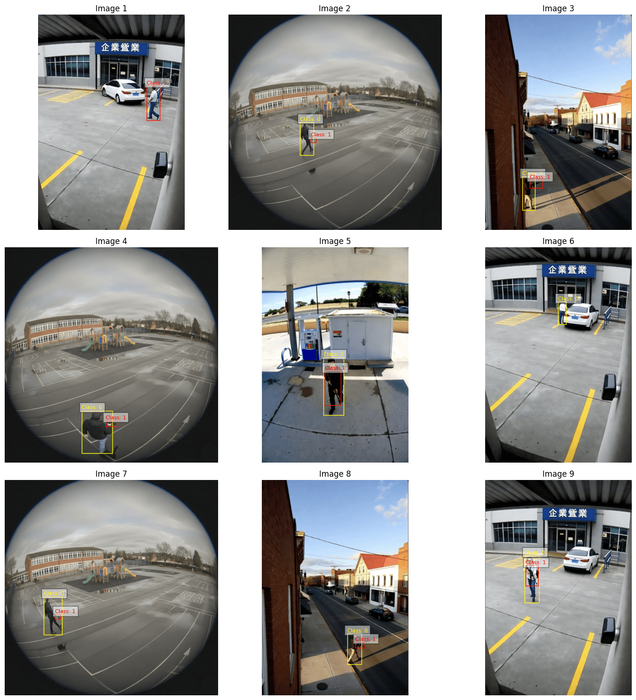
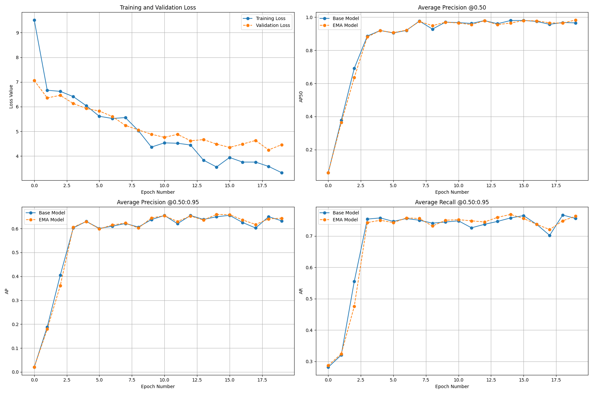

# Real Use Case

This directory contains examples demonstrating end-to-end workflows using the pipeline — for instance, fine-tuning and evaluating RF-DETR for weapon detection in CCTV footage. More examples (different datasets, deployment targets, and demos) will be added over time.

## Weapon Detection in CCTV Footage

### Motivation

Weapon detection in CCTV footage addresses a critical public-safety need: early identification of potentially dangerous situations can speed responses, deter criminal activity, and provide valuable evidence for investigations.
Automated detection helps scale monitoring across many cameras, supports faster operator triage, and can enable proactive interventions when configured with appropriate human-in-the-loop safeguards.
Practical deployments must balance detection accuracy with privacy, false-positive management, and clear escalation policies.

Embedded (edge) devices are a common deployment target for CCTV analytics.
Running detection on-device reduces latency and bandwidth use, preserves privacy by avoiding raw-video uploads, and enables resilience when network connectivity is limited.
However, embedded deployments impose constraints (limited compute, memory, and power) that require model optimization (quantization, pruning), efficient architectures, and sometimes hardware acceleration (e.g., NPU, GPU, or DSP).

### Step-by-Step Guide

1. Download the dataset as above.
   
2. Prepare your data by converting to COCO format using the CLI:
   ```bash
   python -m rf_detr_finetuning download kaggle-dataset \
      --name simuletic/cctv-weapon-dataset --dest data
   python -m rf_detr_finetuning convert yolo-to-coco \
      --input_dir data/simuletic/cctv-weapon-dataset/Dataset \
      --output_dir data/cctv-weapon-dataset_coco \
      --class_names '{"0": "person", "1": "weapon"}'
   ```
3. Run training with a config tailored for weapon detection.
   ```bash
   python -m rf_detr_finetuning train \
      --dataset data/cctv-weapon-dataset_coco \
      --config_file config/weapon_detection.yaml
   ```
   
4. Evaluate the model on test footage.
   ```bash
   python -m rf_detr_finetuning predict \
      --model_path output/checkpoint_best_total.pth \
      --image_path data/simuletic/cctv-weapon-dataset/Dataset/images/Scene1_2.png
   ```

See the main README for module details and configuration options.
